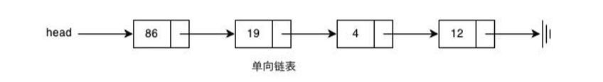
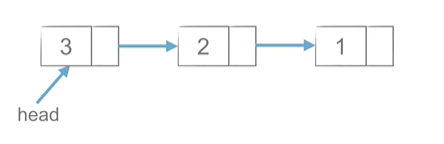
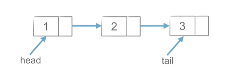
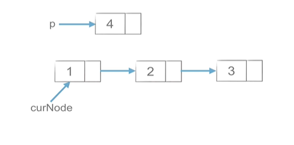
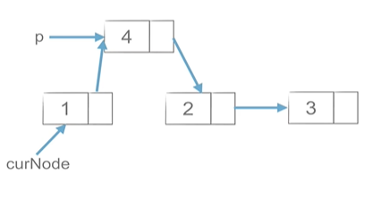

# 20221213单链表

> 链表是由一系列的节点组成的元素集合。每个节点包含两个部分。数据域item和指向下一个节点的指针next。通过节点之间的相互连接，最终形成一个链表

```python
class Node:
    def __init__(self,item):
        self.item = item#数据域
        self.next=None#指针
#存储节点数据
a= Node(1)
b= Node(2)
c= Node(3)
a.next=b#a指向b
b.next=c
print (a.next.next.item)
# a->b->c--|---1-->2---->3
```

+ 单链表储存的模型



## 1.创建链表

### 1.1头插法

> 只用维护一个头节点(head节点)

+ 模型




```python
def create_linklist(li):
    head=Node(li[0])#头节点
    for element in li[1:]:
        node=Node(element)
        node.next=head
        head=node
    return head
```


### 1.2 尾插法

> 维护两个节点(head节点)和尾（tail)节点

+ 模型




```python
def create_linklist_tail(li):
    head=Node(li[0])#头节点
    tail=head#尾节点
    for element in li[1:]:
        node=Node(element)
        tail.next=node
        tail=node
    return head
```

### 总

```python
class Node:
    def __init__(self,item):
        self.item = item
        self.next=None

def create_linklist(li):
    head=Node(li[0])#头节点
    for element in li[1:]:
        node=Node(element)
        node.next=head
        head=node
    return head

def create_linklist_tail(li):
    head=Node(li[0])#头节点
    tail=head#尾节点
    for element in li[1:]:
        node=Node(element)
        tail.next=node
        tail=node
    return head

def print_linklist(lk):
    while lk:
        print (lk.item,end=" ")
        lk=lk.next
li=create_linklist([1,2,3])
lk=create_linklist_tail([1,2,3,87,46871,87,61,6,76])
print ("头插法",end=" :")
print_linklist(li)
print()
print ("尾插法",end=" :")
print_linklist(lk)
```


## 2.链表节点的操作

### 2.1插入

```python
p.next=curNode.next
curNode.next=p
先连接当前节点后面的一个节点；再与前一个节点通过next相连
关键：先尾后头
```



### 2.2删除

```
p=curNode.next
curNode.next=curNode.next.next
del p#删除该节点
关键：先头后尾
```



## 习题

[707. 设计链表 - 力扣（Leetcode）](https://leetcode.cn/problems/design-linked-list/)

### 题目

设计链表的实现。您可以选择使用单链表或双链表。单链表中的节点应该具有两个属性：`val` 和 `next`。`val` 是当前节点的值，`next` 是指向下一个节点的指针/引用。如果要使用双向链表，则还需要一个属性 `prev` 以指示链表中的上一个节点。假设链表中的所有节点都是 0-index 的。

在链表类中实现这些功能：

- get(index)：获取链表中第 `index` 个节点的值。如果索引无效，则返回`-1`。
- addAtHead(val)：在链表的第一个元素之前添加一个值为 `val` 的节点。插入后，新节点将成为链表的第一个节点。
- addAtTail(val)：将值为 `val` 的节点追加到链表的最后一个元素。
- addAtIndex(index,val)：在链表中的第 `index` 个节点之前添加值为 `val` 的节点。如果 `index` 等于链表的长度，则该节点将附加到链表的末尾。如果 `index` 大于链表长度，则不会插入节点。如果`index`小于0，则在头部插入节点。
- deleteAtIndex(index)：如果索引 `index` 有效，则删除链表中的第 `index` 个节点。

 

**示例：**

```
MyLinkedList linkedList = new MyLinkedList();
linkedList.addAtHead(1);
linkedList.addAtTail(3);
linkedList.addAtIndex(1,2);   //链表变为1-> 2-> 3
linkedList.get(1);            //返回2
linkedList.deleteAtIndex(1);  //现在链表是1-> 3
linkedList.get(1);            //返回3
```

 

### 题解(写法有点垃圾)格局小了

```python
#创建节点类
class Node:
    def __init__(self,val):
        self.val=val
        self.next=None

class MyLinkedList(object):

    def __init__(self):
        self.size=0#单链表的长度
        self.head=Node(-1)
        
    
    def get(self, index):#获取链表中第 index 个节点的值。如果索引无效，则返回-1。
        """
        :type index: int
        :rtype: int
        """
        head=self.head#该节点等于头节点
        if index>=self.size:
            return -1
        while index and head.next:
            head=head.next
            index-=1
        return head.val

	
    def addAtHead(self, val):#在链表的第一个元素之前添加一个值为 val 的节点。插入后，新节点将成为链表的第一个节点。
        """
        :type val: int
        :rtype: None
        """
        head=self.head#头节点
        p=Node(val)#新加节点
        p.next=head#新加节点的下一个节点是头节点
        self.head=p
        self.size+=1#增加了节点，长度+1
        return head


    def addAtTail(self, val):#将值为 val 的节点追加到链表的最后一个元素。
        """
        :type val: int
        :rtype: None
        """
        # head=self.head#头节点
        # tail=head#尾节点
        # node=Node(val)#新加节点
        # f=self.size#
        # while f-1> 0:
        #     f-=1
        #     tail=tail.next
        # tail.next=node
        # tail=node
        # self.size+=1
        # return head
        self.addAtIndex(self.size, val)#观摩题解，可以直接用插入的方法

    def addAtIndex(self, index, val):#在链表中的第 index 个节点之前添加值为 val  的节点。如果 index 等于链表的长度，则该节点将附加到链表的末尾。如果 index 大于链表长度，则不会插入节点。如果index小于0，则在头部插入节点。
        """
        :type index: int
        :type val: int
        :rtype: None
        """
        if index>self.size:#判断索引是否有效
            return -1
        if index ==0:
            self.addAtHead(val)#当index==0时直接调用头节点插入的方法
            return 
        head=self.head
        index=index-1#使得head是要添加节点的前一个节点
        while index and head.next:
            index-=1
            head=head.next  
        #添加节点
        p=Node(val)
        p.next=head.next
        head.next=p
        self.size+=1
        return head.val


    def deleteAtIndex(self, index):#如果索引 index 有效，则删除链表中的第 index 个节点。
        """
        :type index: int
        :rtype: None
        """
        if index>=self.size:#判断索引是否有效
            return -1
        head=self.head
        index=index-1#使得head是要删除节点的前一个节点
        if index==-1:#删除头节点
                head=head.next
                head.next=head.next
                self.head=head
                return head
        while index and head.next:
            head=head.next
            index-=1
        #节点的删除
        p=head.next
        head.next=head.next.next
        self.size-=1
        del p
        return head


# Your MyLinkedList object will be instantiated and called as such:
# obj = MyLinkedList()
# param_1 = obj.get(index)
# obj.addAtHead(val)
# obj.addAtTail(val)
# obj.addAtIndex(index,val)
# obj.deleteAtIndex(index)
```

