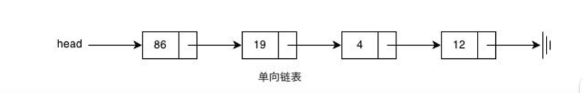
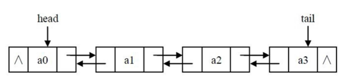
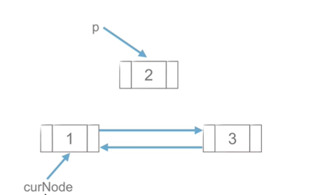
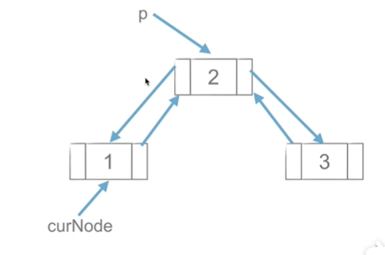

# 双链表

> 双链表每个节点具有不仅数据区域同时还具有两个指针：一个指向后一个节点，另一个指向前一个节点

```python
class Node:
    def __init__(self,item=None):
        self.item = item
        self.next=None
        self.prev=None
```

+ 单链表



+ 双链表



+ 单链表和双链表
  + 区别：单链表只能指向下一个节点而双链表只能指向上一个节点
  + 共同点：均具有数据区域

## 双链表的相关操作

### 插入

```
p.next=curNode.next
curNode.next.prior=p
p.piror=curNode
curNode.next=p
```




### 删除

```
p=curNode.next
curNode.next=p.next
p.next.prior=curNode
del P
```



## 习题

### 题目介绍

[430. 扁平化多级双向链表 - 力扣（Leetcode）](https://leetcode.cn/problems/flatten-a-multilevel-doubly-linked-list/description/)

#### 430.扁平化多级双向链表

你会得到一个双链表，其中包含的节点有一个下一个指针、一个前一个指针和一个额外的 **子指针** 。这个子指针可能指向一个单独的双向链表，也包含这些特殊的节点。这些子列表可以有一个或多个自己的子列表，以此类推，以生成如下面的示例所示的 **多层数据结构** 。

给定链表的头节点 head ，将链表 **扁平化** ，以便所有节点都出现在单层双链表中。让 `curr` 是一个带有子列表的节点。子列表中的节点应该出现在**扁平化列表**中的 `curr` **之后** 和 `curr.next` **之前** 。

返回 *扁平列表的 `head` 。列表中的节点必须将其 **所有** 子指针设置为 `null` 。*

 

**示例 1：**


```
输入：head = [1,2,3,4,5,6,null,null,null,7,8,9,10,null,null,11,12]
输出：[1,2,3,7,8,11,12,9,10,4,5,6]
解释：输入的多级列表如上图所示。
扁平化后的链表如下图：
```

**示例 2：**


```
输入：head = [1,2,null,3]
输出：[1,3,2]
解释：输入的多级列表如上图所示。
扁平化后的链表如下图：
```

**示例 3：**

```
输入：head = []
输出：[]
说明：输入中可能存在空列表。
```

 

**提示：**

- 节点数目不超过 `1000`
- `1 <= Node.val <= 105`

 

**如何表示测试用例中的多级链表？**

以 **示例 1** 为例：

```
 1---2---3---4---5---6--NULL
         |
         7---8---9---10--NULL
             |
             11--12--NULL
```

序列化其中的每一级之后：

```
[1,2,3,4,5,6,null]
[7,8,9,10,null]
[11,12,null]
```

为了将每一级都序列化到一起，我们需要每一级中添加值为 null 的元素，以表示没有节点连接到上一级的上级节点。

```
[1,2,3,4,5,6,null]
[null,null,7,8,9,10,null]
[null,11,12,null]
```

合并所有序列化结果，并去除末尾的 null 。

```
[1,2,3,4,5,6,null,null,null,7,8,9,10,null,null,11,12]
```

#### 题解

```python
"""
# Definition for a Node.
class Node(object):
    def __init__(self, val, prev, next, child):
        self.val = val
        self.prev = prev
        self.next = next
        self.child = child
"""

class Solution(object):
    def flatten(self, head):
        """
        :type head: Node
        :rtype: Node
        """
        if head ==None:#当前该节点为空时，即只返回该节点
            return head
        x=[]#存放节点
        temp=head #当前节点
        while temp:
            if temp.child:#如果该节点有孩子
                if temp.next:#有子节点且有next
                    x.append(temp.next) #就保存该节点
                temp.child.prev=temp #让node.child 保存为node.next
                temp.next=temp.child#同上
                temp.child=None#将子节点置空
            if not temp.next and x:# 如果走到底没有next了，就把之前保存的next拿出来
                last_next=x.pop()#x里最后一个就是最新的next
                temp.next=last_next#让它，变成当前node的next
                last_next.prev=temp
            temp=temp.next #当该节点没有孩子的情况即为保存该节点进入下一个节点
        return head

```

