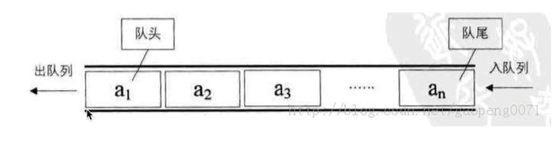
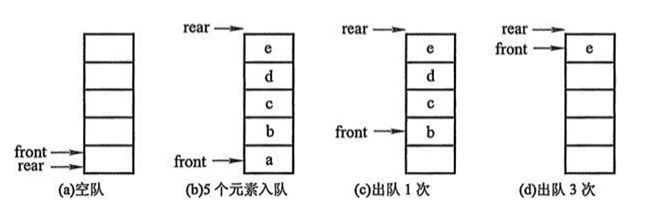
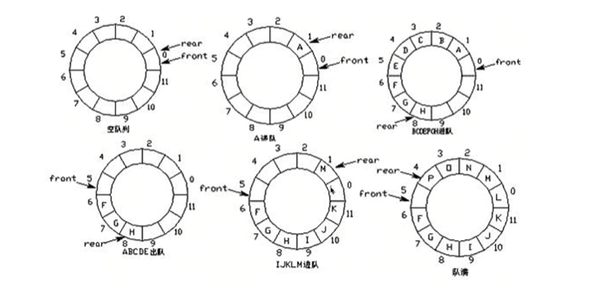

# 20221221队列

> 队列（Queue）是一个数据集合，仅仅允许在列表的一端进行插入，另一端进行删除

+ 进入插入一端称为队尾，插入动作称为进队或入队
+ 进行删除的一端称为队头，删除动作成为i出队
+ 基本性质：先进先出FIFO(First-in，First-out)



## 顺序队列



+ 顺序队列
  + 队空:rear==front
  + 队满：front==(rear+1)%Maxsize
  + 入队 rear=(rear+1)%Maxsize
  + 出队：front=(front+1)%Maxsize

## 环形队列

> 就是将一般队列的头尾相连



<font color="red">front:队首；rear:队尾；Maxsize:队列长度</font>

+ 环形队列：当队尾指针front==Maxsize+1时，再前进一个位置就自动到0
  + 队首指针前进1：front=(front+1)%Maxsize
  + 队尾指针前进1：rear=(reart+1)%Maxsize
  + 队空;rear==front
  + 队满：（rear+1）% Maxsize ==front

```py
class Queue:
    def __init__(self,size=100):
        self.queue = [0 for _ in range(size)]#队列的大小
        self.size=size#队列的最大长度
        self.rear=0#队尾（进队）
        self.front=0#队首（出队）

    #入队
    def push(self,element):
        if not self.is_filled():
            self.rear=(self.rear+1)%self.size#入队的队尾的变化
            self.queue[self.rear] = element#在该位置上添加element元素
        else:
            raise IndexError("Queue is filled.")
    
    #出队
    def pop(self):
        if not self.is_empty():
            self.front=(self.front+1)%self.size#出队的队首的变化
            return self.queue[self.front]
        else:
            raise IndexError("Queue is empty.")

    #判断是否对空
    def is_empty(self):
        return self.front == self.rear
    
    #判断是否队满
    def is_filled(self):
        return (self.rear +1)%self.size == self.front

q=Queue(5)
for i in range(4):
    q.push(i)#入队
print(q.pop())#队出
```


## 双向队列

> 双向队列的两端都支持进队和出队操作

+ 基本操作
  + 队首入队
  + 队首出队
  + 队尾入队
  + 队尾出队

### 队列的内置模块

> 使用方法：from collections import deque

+ 创建队列 ： queue=deque()
  + 进队：append()
  + 出队：popleft()
  + 双向队列队首进队;appendledt()
  + 双向队列队尾出队：pop()

## 习题

### 1.[622. 设计循环队列 - 力扣（Leetcode）](https://leetcode.cn/problems/design-circular-queue/description/)

####  详情


相关企业

设计你的循环队列实现。 循环队列是一种线性数据结构，其操作表现基于 FIFO（先进先出）原则并且队尾被连接在队首之后以形成一个循环。它也被称为“环形缓冲器”。

循环队列的一个好处是我们可以利用这个队列之前用过的空间。在一个普通队列里，一旦一个队列满了，我们就不能插入下一个元素，即使在队列前面仍有空间。但是使用循环队列，我们能使用这些空间去存储新的值。

你的实现应该支持如下操作：

- `MyCircularQueue(k)`: 构造器，设置队列长度为 k 。
- `Front`: 从队首获取元素。如果队列为空，返回 -1 。
- `Rear`: 获取队尾元素。如果队列为空，返回 -1 。
- `enQueue(value)`: 向循环队列插入一个元素。如果成功插入则返回真。
- `deQueue()`: 从循环队列中删除一个元素。如果成功删除则返回真。
- `isEmpty()`: 检查循环队列是否为空。
- `isFull()`: 检查循环队列是否已满。

 

**示例：**

```
MyCircularQueue circularQueue = new MyCircularQueue(3); // 设置长度为 3
circularQueue.enQueue(1);  // 返回 true
circularQueue.enQueue(2);  // 返回 true
circularQueue.enQueue(3);  // 返回 true
circularQueue.enQueue(4);  // 返回 false，队列已满
circularQueue.Rear();  // 返回 3
circularQueue.isFull();  // 返回 true
circularQueue.deQueue();  // 返回 true
circularQueue.enQueue(4);  // 返回 true
circularQueue.Rear();  // 返回 4
```

 

**提示：**

- 所有的值都在 0 至 1000 的范围内；
- 操作数将在 1 至 1000 的范围内；
- 请不要使用内置的队列库。

####  题解

```python
class MyCircularQueue(object):

    def __init__(self, k):
        """
        :type k: int
        """
        self.queue = [0 for _ in range(k+1)]#+1是为了留一个空间来判断队是否尾空还是
        self.front=0#队首
        self.rear=0#队尾
        self.size=k+1#队列的最大长度
        


    def enQueue(self, value):
        """
        :type value: int
        :rtype: bool
        """
        if not self.isFull():#入队是当队伍为非满的情况下
            self.queue[self.rear]=value#在rear所值的区域内放值
            self.rear=(self.rear+1)%self.size#rear向后移动一位
            return  True
        return False

    def deQueue(self):
        """
        :rtype: bool
        """
        if not self.isEmpty():#入队是当队伍为非空的情况下
            self.queue[self.front]= 0#将要出队的值设置为0
            self.front=(self.front+1)%self.size#出队的队首向后移一位并始终指向队首的第一个元素
            return True
        return False


    def Front(self):
        """
        :rtype: int
        """
        if not self.isEmpty():
            return self.queue[self.front]#front 是指向队首的第一个元素
        return -1


    def Rear(self):
        """
        :rtype: int
        """
        if not self.isEmpty():
            return self.queue[self.rear-1]#rear是指向队尾元素的后一个的区域
        return -1


    def isEmpty(self):
        """
        :rtype: bool
        """
        return self.rear==self.front#判断队是否为空的条件


    def isFull(self):
        """
        :rtype: bool
        """
        return (self.rear+1)%self.size==self.front#判断队是否为满的条件


# Your MyCircularQueue object will be instantiated and called as such:
# obj = MyCircularQueue(k)
# param_1 = obj.enQueue(value)
# param_2 = obj.deQueue()
# param_3 = obj.Front()
# param_4 = obj.Rear()
# param_5 = obj.isEmpty()
# param_6 = obj.isFull()
```

###  [899. 有序队列 - 力扣（Leetcode）](https://leetcode.cn/problems/orderly-queue/description/)

#### 详情

给定一个字符串 `s` 和一个整数 `k` 。你可以从 `s` 的前 `k` 个字母中选择一个，并把它加到字符串的末尾。

返回 *在应用上述步骤的任意数量的移动后，字典上最小的字符串* 。

 

**示例 1：**

```
输入：s = "cba", k = 1
输出："acb"
解释：
在第一步中，我们将第一个字符（“c”）移动到最后，获得字符串 “bac”。
在第二步中，我们将第一个字符（“b”）移动到最后，获得最终结果 “acb”。
```

**示例 2：**

```
输入：s = "baaca", k = 3
输出："aaabc"
解释：
在第一步中，我们将第一个字符（“b”）移动到最后，获得字符串 “aacab”。
在第二步中，我们将第三个字符（“c”）移动到最后，获得最终结果 “aaabc”。
```

**提示：**

- `1 <= k <= S.length <= 1000`
- `s` 只由小写字母组成。

#### 题解

```python
class Solution(object):
    def orderlyQueue(self, s, k):
        """
        :type s: str
        :type k: int
        :rtype: str
        """
        if len(s)==1:
            return s#当字符串中s只有1个时，直接返回s
        if k==1:
            indexs=[]
            min1=min(s)
            for i in range(len(s)):
                if s[i]== min1:
                    indexs.append(i)#收集该字符串中最小值的索引
            if len(indexs)==1:
                return s[indexs[0]:]+s[0:indexs[0]]#当最小值只存在一个时，之间将它前面放到该最后一位的后面
            else:
                s1=[]
                for i in range(len(indexs)-1):
                    M=min(len(s),indexs[i+1]-indexs[i])
                M=min(M,len(s)-indexs[-1]+indexs[0])#找到字符串最小的字符两个之间间隔最小的距离，因为在相同长度下的字符串之间可以进行比较，所以需要截取相同长度的字符串以便比较
                print(M)
                for i in indexs:
                    if M>len(s)-i-1:#当该字符的索引最小值到最后字符的位置字符串的长度小于设置的最小值
                        s1.append(s[i:]+s[:M+i+1-len(s)])#从该字符串的头部位去选取
                    else:
                        s1.append(s[i:i+1+M])#截取设置长度的字符串长度
                s1=s1.index(min(s1))#获取最小字符串的最小字符中能使该字符串的字典上最小的字符串的索引
                return s[indexs[s1]:]+s[:indexs[s1]]
            
        return "".join(sorted(s))#当k>1时，那么就可以将每个字母进行选择性排序，就可以称为一个有序的队列
```

